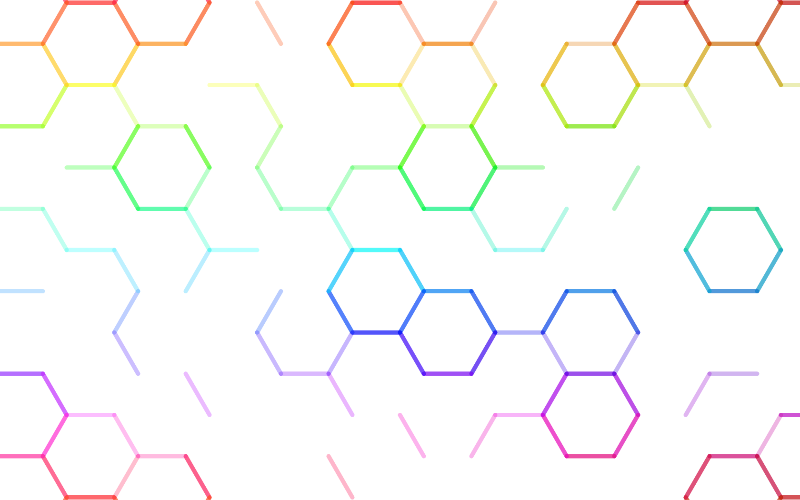

# [hexagonif](https://joelpurra.com/projects/hexagonif/)

<p class="donate">
  <a href="https://joelpurra.com/donate/proceed/?amount=5&currency=usd"><kbd>Donate $5 now</kbd></a>
  <a href="https://joelpurra.com/donate/proceed/?amount=25&currency=usd"><kbd>Donate $25 now</kbd></a>
  <a href="https://joelpurra.com/donate/proceed/?amount=100&currency=usd&invoice=true"><kbd>Donate $100 now</kbd></a>
  <a href="https://joelpurra.com/donate/"><kbd>More options</kbd></a>
</p>

[](https://joelpurra.com/projects/hexagonif/)


> ## ⚠️ This project has been archived
>
> No future updates are planned. Feel free to continue using it, but expect no support.


Played around with the HTML5 `<canvas>` element for use in the background of a website, and ended up with this little toy. [Play around with the interactive demo.](https://joelpurra.com/projects/hexagonif/) The name "hexagonif" comes from [hexagon](https://en.wiktionary.org/wiki/hexagon) and [gonif](https://en.wiktionary.org/wiki/gonif).

- [Interactive demo](https://joelpurra.com/projects/hexagonif/)
- [Source code](https://github.com/joelpurra/hexagonif)


## Use on your website

If you'd like, you can put hexagonif in the background of your own website, as shown on [joelpurra.com](https://joelpurra.com/). See [`docs/index.html`](docs/index.html) and the list below for examples.

If you do use hexagonif, please link back to [joelpurra.com](https://joelpurra.com/) and this project from your website -- and why not add it to the list below?


### Sites using hexagonif

- [joelpurra.com](https://joelpurra.com/)


## Development

Requires [`node`](https://nodejs.org) with `npm` installed.

```shell
# Get dependencies.
npm install

# Puts files in /docs/ for static viewing.
npm run --silent build

# Starts a development server and monitors files for changes.
npm run --silent start

# Go to the default development server address.
open "http://localhost:47333/"
```


---


[hexagonif](https://github.com/joelpurra/hexagonif) Copyright &copy; 2014, 2015, 2016, 2017 [Joel Purra](https://joelpurra.com/). Licensed under the [GNU Affero General Public License, Version 3 (AGPL-3.0)](https://www.gnu.org/licenses/agpl-3.0.html). [Your donations are appreciated!](https://joelpurra.com/donate/)
